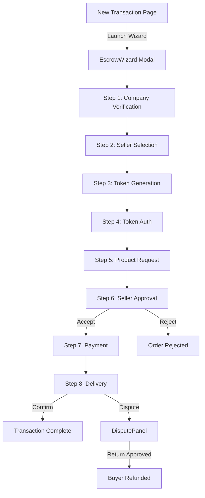

# Escrow Transaction Wizard — Walkthrough

## What Was Built

A complete **9-step escrow transaction wizard** that simulates the entire B2B trade agreement process. Uses React state + localStorage for frontend-only simulation, with backend-ready service stubs.

## Architecture

## Files Created

### Services (`src/services/`)

| File | Purpose |
|---|---|
| [companyVerification.ts](file:///c:/Users/Admin/Downloads/escrow-saaas/src/services/companyVerification.ts) | CIN/GSTIN validation, localStorage persistence |
| [tokenService.ts](file:///c:/Users/Admin/Downloads/escrow-saaas/src/services/tokenService.ts) | Token generation (`ESCROW-XXXX-XXXX-XXXX`), verification |
| [mockMailer.ts](file:///c:/Users/Admin/Downloads/escrow-saaas/src/services/mockMailer.ts) | Simulated email sending |
| [transactionService.ts](file:///c:/Users/Admin/Downloads/escrow-saaas/src/services/transactionService.ts) | State machine, timer logic, MongoDB model stubs |
| [db.ts](file:///c:/Users/Admin/Downloads/escrow-saaas/src/services/db.ts) | Placeholder MongoDB connection |

### Components (`src/components/escrow/`)

| File | Step | Highlights |
|---|---|---|
| [EscrowWizard.tsx](file:///c:/Users/Admin/Downloads/escrow-saaas/src/components/escrow/EscrowWizard.tsx) | Master | Full-screen modal, 9-step stepper, AnimatePresence |
| [CompanyVerificationForm.tsx](file:///c:/Users/Admin/Downloads/escrow-saaas/src/components/escrow/CompanyVerificationForm.tsx) | 1 | 8-field form, green trust badge animation |
| [SellerSelector.tsx](file:///c:/Users/Admin/Downloads/escrow-saaas/src/components/escrow/SellerSelector.tsx) | 2 | 8 mock sellers, search, trust scores |
| [TokenGenerator.tsx](file:///c:/Users/Admin/Downloads/escrow-saaas/src/components/escrow/TokenGenerator.tsx) | 3 | Token display, copy buttons, email notification |
| [TokenVerification.tsx](file:///c:/Users/Admin/Downloads/escrow-saaas/src/components/escrow/TokenVerification.tsx) | 4 | Buyer token input + validation |
| [ProductRequestForm.tsx](file:///c:/Users/Admin/Downloads/escrow-saaas/src/components/escrow/ProductRequestForm.tsx) | 5 | Product details, live total, summary card |
| [SellerApprovalPanel.tsx](file:///c:/Users/Admin/Downloads/escrow-saaas/src/components/escrow/SellerApprovalPanel.tsx) | 6 | Seller token verify, Accept/Reject |
| [PaymentSimulation.tsx](file:///c:/Users/Admin/Downloads/escrow-saaas/src/components/escrow/PaymentSimulation.tsx) | 7 | Payment button, funded animation, timeline |
| [DeliveryConfirmation.tsx](file:///c:/Users/Admin/Downloads/escrow-saaas/src/components/escrow/DeliveryConfirmation.tsx) | 8 | Confirm/Report Issue buttons |
| [DisputePanel.tsx](file:///c:/Users/Admin/Downloads/escrow-saaas/src/components/escrow/DisputePanel.tsx) | 9 | Issue form, countdown timer, return flow |

### Updated Pages

- [buyer/new-transaction/page.tsx](file:///c:/Users/Admin/Downloads/escrow-saaas/src/app/dashboard/buyer/new-transaction/page.tsx) — "Launch Escrow Wizard" button
- [seller/new-transaction/page.tsx](file:///c:/Users/Admin/Downloads/escrow-saaas/src/app/dashboard/seller/new-transaction/page.tsx) — Same wizard for seller role

## How to Test

1. Go to **Dashboard → New Transaction** (sidebar)
2. Click **"Launch Escrow Wizard"**
3. Walk through all 9 steps:
   - **Step 1**: Enter any company details with **CIN = 21 chars** and **GSTIN = 15 chars** → green badge
   - **Step 2**: Search and click a seller card
   - **Step 3**: Copy the **Buyer Token** shown
   - **Step 4**: Paste the buyer token → verified
   - **Step 5**: Fill product details → review summary
   - **Step 6**: Paste the **Seller Token** from Step 3 → Accept Order
   - **Step 7**: Click "Simulate Secure Payment" → funded animation
   - **Step 8**: Confirm Delivery → complete, OR Report Issue → dispute
   - **Step 9**: If dispute: fill details, seller approves return → refunded

## Validation

- ESLint: **0 errors** on all new escrow files
- localStorage keys used: `escrow_buyer_company`, `escrow_selected_seller`, `escrow_tokens`, `escrow_product_request`, `escrow_transaction`, `escrow_dispute`
